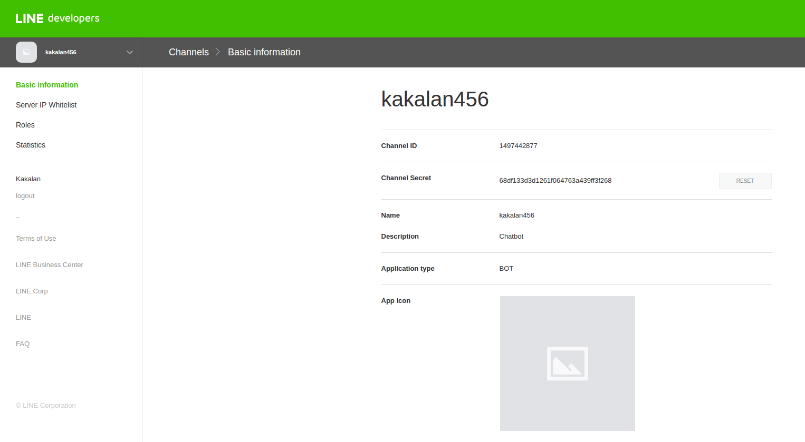

# Create your Line bot in Python with botimize bot-analytics service

Here is our 10 min guide to create an echo-bot on telegram with [botimize](http://www.botimize.io) **bot analytic** service.

## Installation

```python
$ pip install line-bot-sdk
```

## Create a Line bot and get its Channel token,Channel secret

Use Line developers ...

Get Channel secret and Channel access token.


## Create a botimize account and a key for the project

Go to [botimize](https://dashboard.botimize.io/register) and create an account.

Create a new project by clicking new project.


See your **Your_Botimize_Api_Key** by clicking Project Setting


## Create a Python bot

Create a Python script (e.g. echoBot.py) and copy this into it. 

Notice you have to replace <YOUR_CHANNEL_ACCESS_TOKEN>, <YOUR_CHANNEL_SECRET> and <YOUR_BOTIMIZE_APIKEY>.

```
from flask import Flask, request, abort

from linebot import (
    LineBotApi, WebhookHandler
)
from linebot.exceptions import (
    InvalidSignatureError
)
from linebot.models import (
    MessageEvent, TextMessage, TextSendMessage,
)

from botimize import Botimize

app = Flask(__name__)

line_bot_api = LineBotApi(<YOUR_CHANNEL_ACCESS_TOKEN>)
handler = WebhookHandler(<YOUR_CHANNEL_SECRET>)
botimize = Botimize(<YOUR_BOTIMIZE_APIKEY>,"line")

@app.route("/", methods=['POST'])
def ():
    # get X-Line-Signature header value
    signature = request.headers['X-Line-Signature']

    # get request body as text
    body = request.get_data(as_text=True)
    app.logger.info("Request body: " + body)

    event = request.get_json()
    botimize.log_incoming(event)

    # handle webhook body
    try:
        handler.handle(body, signature)
    except InvalidSignatureError:
        abort(400)

    return 'OK'


@handler.add(MessageEvent, message=TextMessage)
def handle_message(event):

    line_bot_api.reply_message(
        event.reply_token,
        TextSendMessage(text=event.message.text))


if __name__ == "__main__":
    app.run()
```

## Talk to your bot
Run on the terminal and listen to 8080 port.

```
python node echoBot.js
```
Now you can talk to your bot!
I name the bot as kakalan456 you can find your bot with the bot name.

